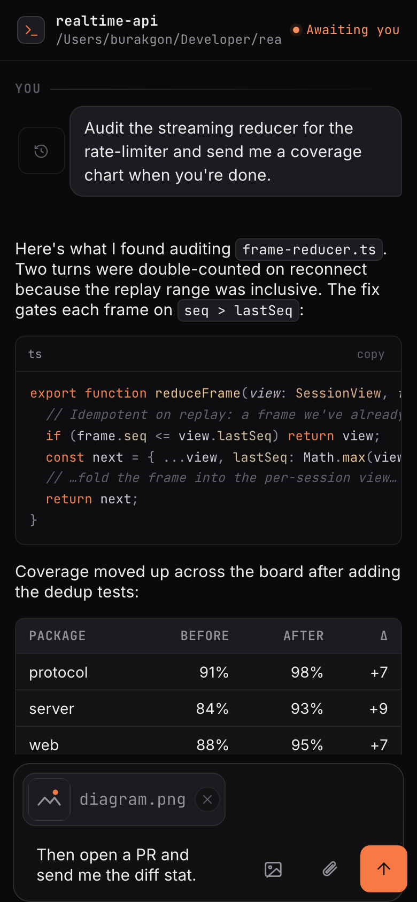
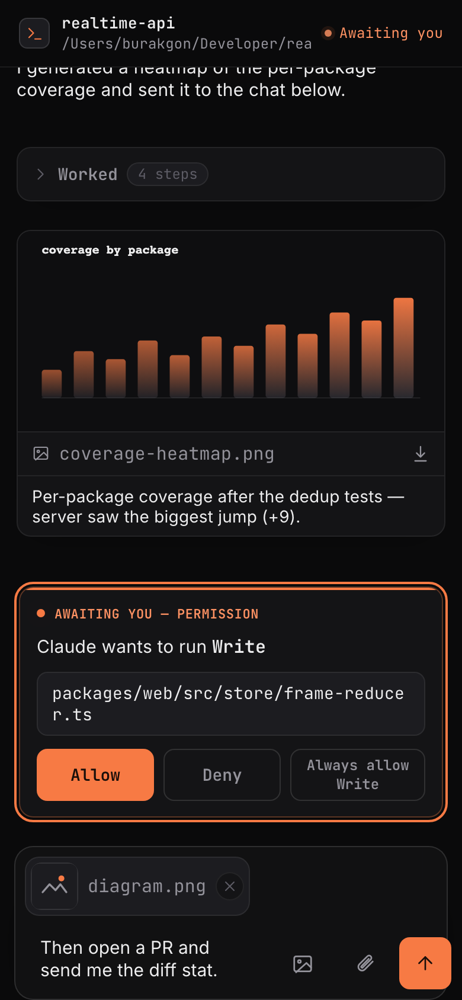
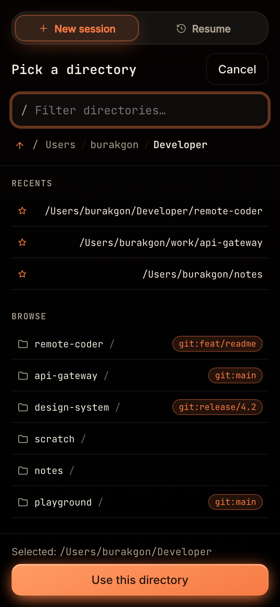
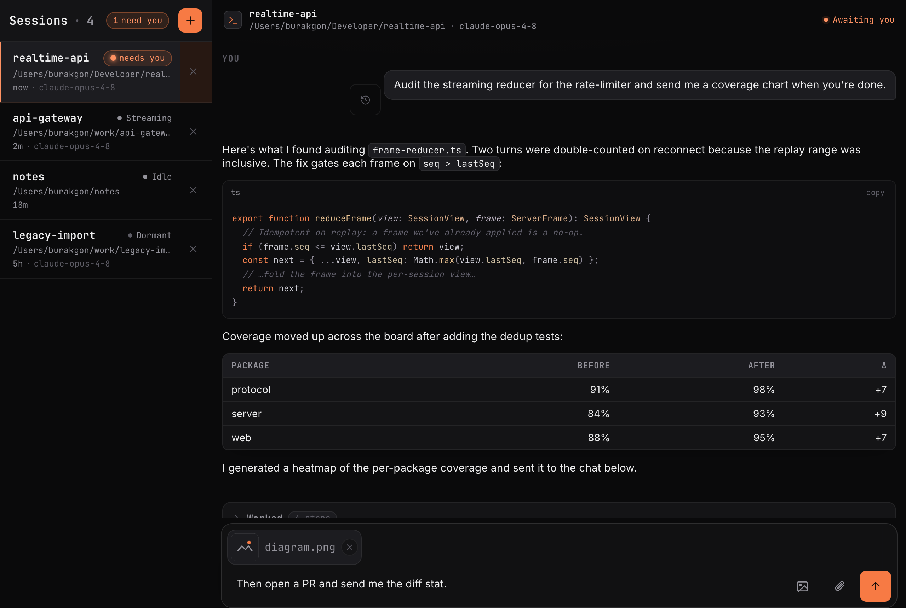
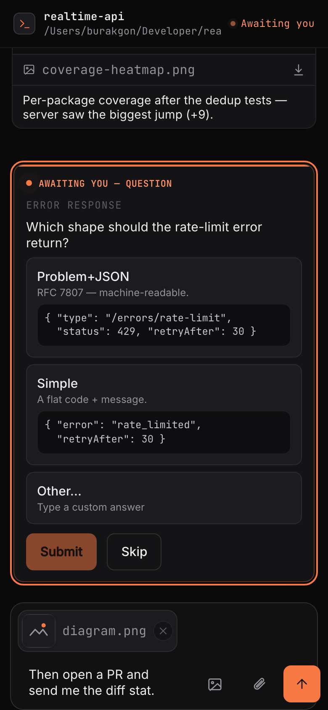
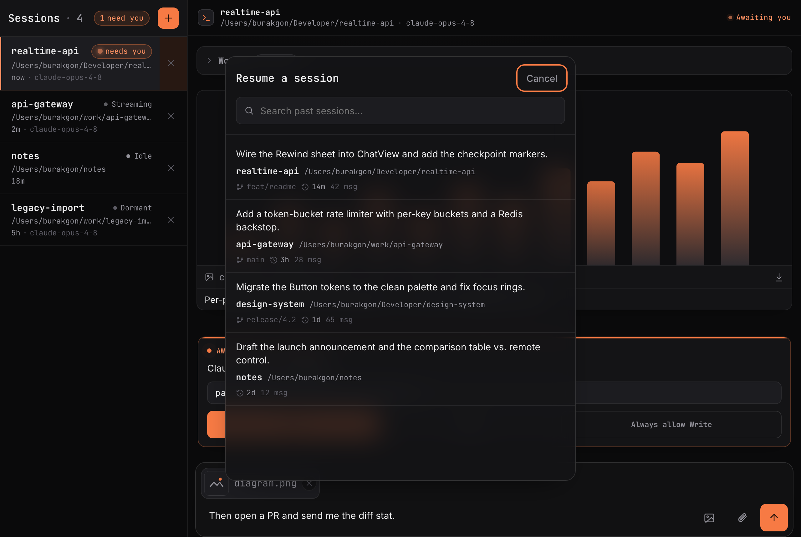
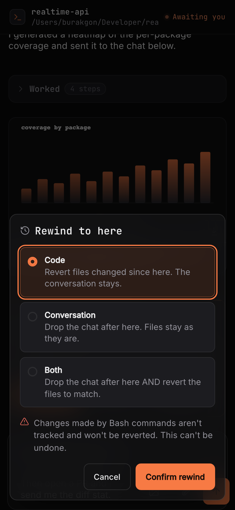

<div align="center">

# remote-coder

### Run Claude Code on your machine — drive it from your phone.

Start a brand-new Claude Code session from anywhere and answer every prompt — permissions, questions, file handoffs — without ever touching the terminal it runs in.

[](LICENSE)
[](#contributing--license)


<br/>


&nbsp;&nbsp;


</div>

---

remote-coder is a self-hosted daemon + installable PWA. It drives the **real `claude` CLI** on your machine using your Claude **subscription** (no API key), and gives you a polished phone app for everything a terminal can't do from your pocket: streaming chat, **answerable** permission &amp; question prompts, files both ways, multi-session, resume, stop, and rewind. Host-native, token-secured, **MIT**.

## Why

Anthropic's own remote control and chat bots can only **resume** sessions started *at the machine*, and chat bots **can't answer permission prompts**. remote-coder closes that gap:

|  | `claude remote-control` | Chat bots | **remote-coder** |
|---|:---:|:---:|:---:|
| Start a **new** session remotely | resume only | No | **Yes** |
| Answer permission prompts | n/a | No | **Yes** |
| Answer multiple-choice questions | n/a | partial | **Yes** |
| Claude sends you files / images | No | Telegram-only | **Yes** |
| Installable PWA · self-host · MIT | — | — | **Yes** |

## What you can do

**🚀 Start &amp; manage sessions remotely** — a git-aware directory picker (branch, recents, breadcrumb) and a session rail with live status and a loud **“needs you”** badge.

<div align="center">

&nbsp;&nbsp;

</div>

**✅ Answer prompts from your phone** — permission cards (Allow / Deny / Always-allow, with destructive commands flagged red) and real multiple-choice questions with an **“Other…”** field and **ASCII / code previews** per option, so you can *see* the choices before you pick.

<div align="center">

</div>

**📎 Files both ways** — upload images &amp; files, browse/download host files (rooted at `FS_ROOT`), and just ask Claude to **send you a file or chart** — it lands inline in your chat.

**⏪ Resume · Stop · Rewind** — run many sessions at once, resume any past conversation, stop a turn mid-flight, and rewind to a checkpoint: revert the code, the conversation, or both — the tappable equivalent of Claude Code's `Esc Esc`.

<div align="center">

&nbsp;&nbsp;

</div>

**🟣 Built to live on your phone** — a dark **“Nebula”** PWA (Add to Home Screen, no app store), **Web Push** when a session needs you, and model + effort switches as first-class controls.

## Quickstart

Needs Node ≥ 20, [pnpm](https://pnpm.io/), and a machine **already logged into `claude`** (run `claude` once locally to authenticate — there is no remote login flow).

```bash
git clone https://github.com/burakgon/remote-coder && cd remote-coder
pnpm install && pnpm build
node packages/cli/dist/index.js
```

It generates an access token (stored `0600` in the data dir) and prints a ready-to-use link:

```
remote-coder is running.
  Open this link to connect:
    http://127.0.0.1:4280/?token=<token>
```

Open it on the same machine, then jump to **[From your phone](#from-your-phone)**.

> `npx remote-coder` isn't published yet — the CLI is `private` while the monorepo stabilizes. Clone + build is the supported path today.

<details>
<summary><b>Flags &amp; environment variables</b></summary>

`node packages/cli/dist/index.js --help` for the full list.

- `--port <n>` — listen port (default `4280`; `0` = free port).
- `--bind <addr>` — bind address (default `127.0.0.1`). Use `0.0.0.0` **only** behind a secure tunnel.
- `--no-token` — loopback dev only; never for public binds.

| Var | Default | Purpose |
|---|---|---|
| `PORT` | `4280` | Listen port (`0` = OS-chosen). |
| `BIND_ADDRESS` | `127.0.0.1` | Bind address. Keep loopback; tunnel for remote. |
| `ACCESS_TOKEN` | _(generated)_ | Override the token (used verbatim, never written to disk). |
| `FS_ROOT` | `$HOME` | Confine the file picker / fs endpoints to a subtree. |
| `MAX_UPLOAD_BYTES` | `26214400` | Upload size cap (25 MiB). |
| `REMOTE_CODER_DATA_DIR` | `~/.config/remote-coder` | SQLite DBs, token, VAPID keys (mode 0700). |
| `TRUST_PROXY` | `false` | Honor `X-Forwarded-For` behind a reverse proxy. |

</details>

## From your phone

The server binds to `127.0.0.1` — **don't expose the port directly.** Put an HTTPS tunnel in front of it (required for the installable PWA + Web Push); the access token is still enforced on every request through the tunnel.

```bash
# with the server running on 127.0.0.1:4280
cloudflared tunnel --url http://127.0.0.1:4280
```

Open the printed `https://…` URL on your phone, enter the token (or use the `?token=…` link to skip the prompt), **Add to Home Screen** to install the app, and enable notifications. *(Tailscale Serve works too: `tailscale serve --bg http://127.0.0.1:4280`.)*

## Keep it running

```bash
node packages/cli/dist/index.js install
```

Writes a per-user service unit — **macOS** LaunchAgent or **Linux** `systemd --user` — and prints the one command to enable it (nothing auto-starts until you opt in). It runs as **you**, not root, with the token read from disk at runtime. On macOS it runs while you're logged in, because Claude's subscription auth needs a real login session.

## Security

remote-coder is **remote code execution on your own host** — that *is* the feature. Treat the token like an SSH key.

- **Mandatory token** on every HTTP request **and** WebSocket — constant-time check, per-client lockout, generic `401`s. It **refuses to start** on a non-loopback bind with no token.
- **HTTPS for anything remote** — a plain public port leaks the token in transit. Use a tunnel; loopback is the only place plain HTTP is fine.
- **The permission gate stays on** — you approve every tool from your phone. `--dangerously-skip-permissions` is **per-session, off by default**, and clearly flagged as unattended RCE.
- **No sandbox** — the `claude` subprocess has your full machine access; `FS_ROOT` only scopes the file endpoints, not the subprocess.

## Contributing &amp; License

Full-TypeScript pnpm monorepo — `protocol` · `server` · `web` · `cli`. PRs and issues welcome.

```bash
pnpm install && pnpm build
pnpm typecheck && pnpm lint && pnpm test
```

**[MIT](LICENSE).**
