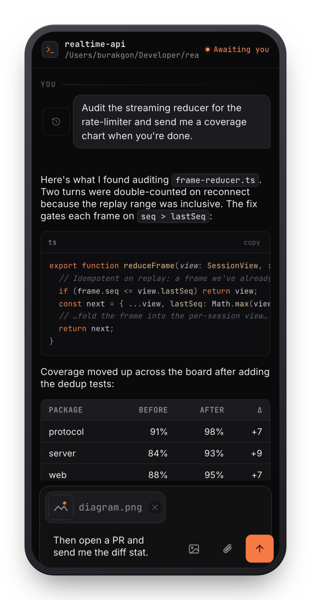
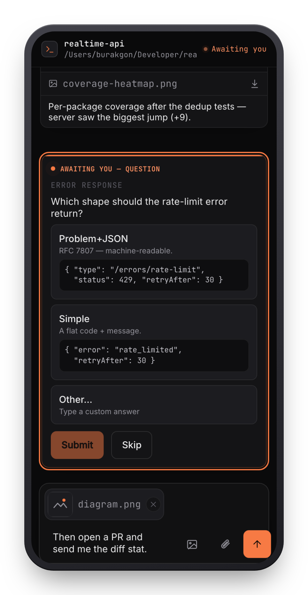
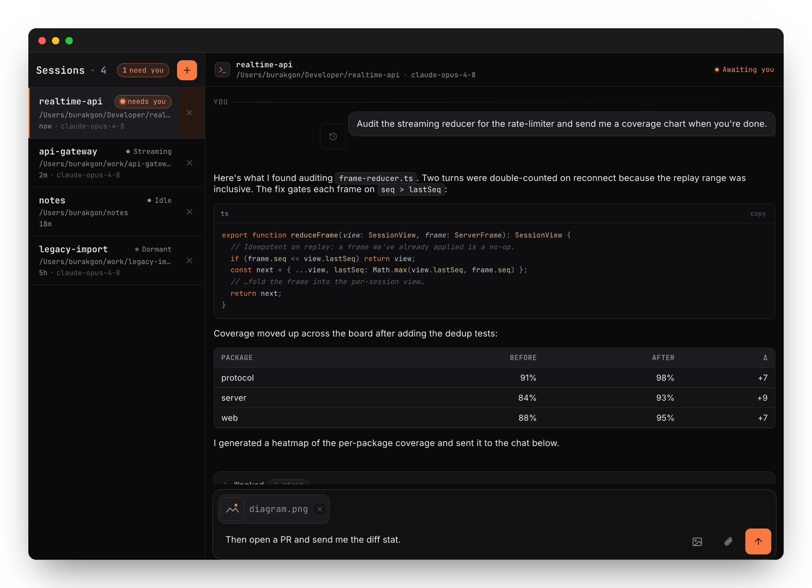
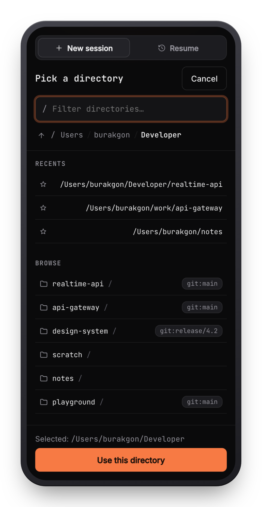
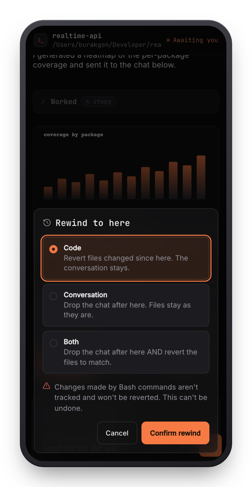
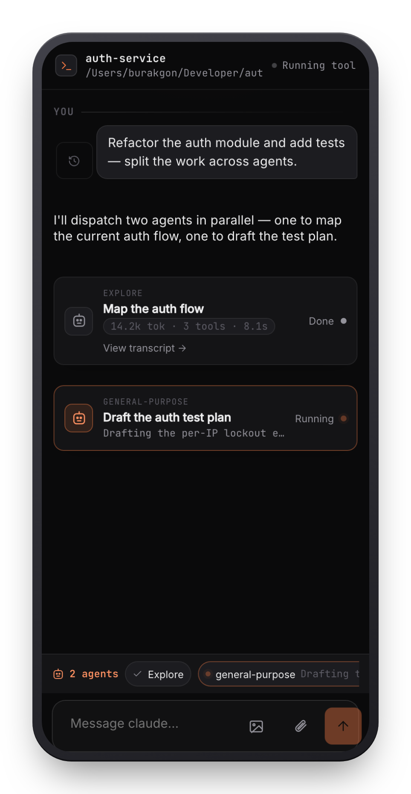
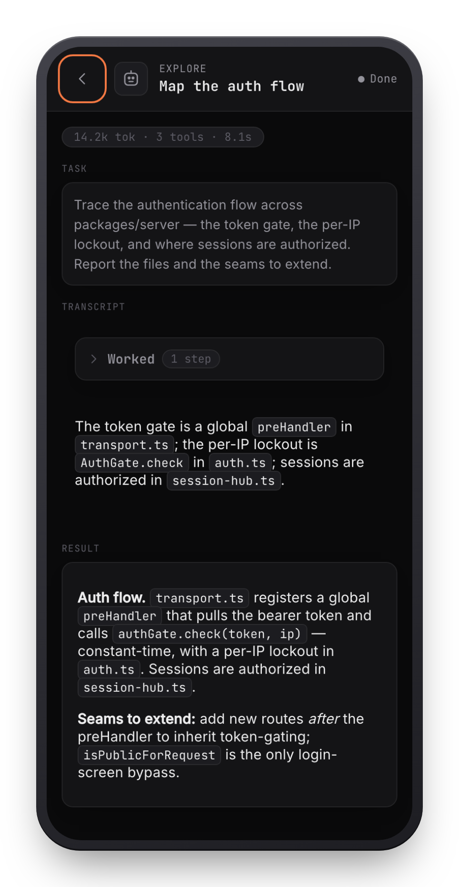

<div align="center">


# Remote Coder

### Claude Code on your machine — fully driven from your phone.

A self-hosted web app that runs the **real `claude` CLI** with your Claude subscription and puts it in your pocket: start new sessions, answer every prompt, hand files back and forth, stop and rewind — without ever touching the terminal it runs in.

[](LICENSE)
&nbsp;
&nbsp;
&nbsp;
&nbsp;

<br/>


&nbsp;


<br/><br/>

**📱 your phone** &nbsp;→&nbsp; 🔒 **your machine** *(Remote Coder)* &nbsp;→&nbsp; 🤖 **`claude` CLI** *(your subscription)*

<sub>Self-hosted · no API key · your code never leaves your machine · secured by a token · MIT</sub>

</div>

---

## What it is

You run a small server on your dev machine. It launches the **real Claude Code CLI** as a subprocess — on your own subscription, no API key — and serves a polished, installable app you open from your phone or any browser. Everything a terminal can't do from your pocket now works: streaming chat with markdown and code, **prompts you can actually answer**, files in both directions, multiple sessions, resume, stop, and rewind.

It's **host-native** (your machine, your files, your `~/.claude`), **secure by default** (a mandatory access token), and **MIT** licensed.

## Why it exists

Anthropic ships first-party remote control and chat bots — but they can only **resume** a session that was already started *at the machine*, and the chat bots **can't answer Claude's permission prompts**. So the moment Claude needs a decision, you're stuck until you're back at your desk.

Remote Coder is the one that closes that gap:

|  | `claude remote-control` | Telegram / Discord bots | **Remote Coder** |
|---|:---:|:---:|:---:|
| Start a **brand-new** session remotely | resume only | ✗ | **✓** |
| Approve / deny tool use from your phone | — | ✗ | **✓** |
| Answer multiple-choice questions | — | partial | **✓** |
| Claude sends you files & images inline | ✗ | Telegram only | **✓** |
| Stop a turn · rewind code & chat | — | ✗ | **✓** |
| Installable app · self-hosted · MIT | — | — | **✓** |

## What you can do

### A real chat, in your pocket
Streaming responses with full markdown, syntax-highlighted code, tables, and collapsible tool steps. Manage many sessions at once from a live rail that shows you exactly which one needs you.

<div align="center">

</div>

### Answer Claude's prompts — from anywhere
When Claude asks to run a tool you get a clean **Allow / Deny / Always-allow** card (destructive commands are flagged). When it asks a question you get real options — with an **“Other…”** free-text answer and **previews per choice** so you can *see* before you pick. This is the thing the chat bots can't do.

<div align="center">



</div>

### Files both ways · resume · stop · rewind
Upload images and files, browse and download host files, and just ask Claude to **send you a chart or file** — it appears inline. **Resume** any past conversation, **stop** a turn mid-flight, and **rewind** to a checkpoint to undo the code, the conversation, or both — the tappable equivalent of Claude Code's `Esc Esc`.

### Watch every subagent it spawns
When Claude dispatches a **subagent**, it surfaces as a live **mission card** in the chat and a chip in the **agents tray** above the composer — each carrying its type, status, and what it's doing right now. Tap one to drill into its own **transcript**: the task it was handed, its tool calls and findings, its result, and its token/time cost. Parallel agents, nested agents — the same visibility the `claude` CLI gives you under the textbox, now in your pocket.

<div align="center">


</div>

### Built to live on your phone
An installable **PWA** (Add to Home Screen, no app store), **Web Push** when a session finishes or needs you, and model + effort switches as first-class controls.

### Updates itself — one tap, no terminal
When a new version lands on GitHub, the app shows an **update notice** with the **version and a grouped changelog**. Tap **Update now** and the server pulls, rebuilds, and restarts itself, then reconnects to the new version — no SSH, no `git pull`. A failed build leaves the running server untouched.

<div align="center">

</div>

## Quickstart

You need **Node ≥ 20**, [**pnpm**](https://pnpm.io/), and a machine **already logged into `claude`** (run `claude` once locally to authenticate — there's no remote login).

```bash
git clone https://github.com/burakgon/remote-coder && cd remote-coder
pnpm install && pnpm build
node packages/cli/dist/index.js
```

It generates an access token and prints a ready-to-use link:

```
Remote Coder is running.
  Open this link to connect:
    http://127.0.0.1:4280/?token=<token>
```

Open it on the same machine — then read **[From your phone](#from-your-phone)** to reach it remotely.

> `npx remote-coder` isn't published yet — the CLI is `private` while the monorepo stabilizes. Clone + build is the supported path today.

## From your phone

The server binds to `127.0.0.1` and **should not be exposed directly**. Put an HTTPS tunnel in front of it (the installable app and Web Push both require HTTPS) — your machine stays the host, and the token is still enforced on every request through the tunnel.

```bash
# with the server running on 127.0.0.1:4280
cloudflared tunnel --url http://127.0.0.1:4280
```

Open the printed `https://…` link on your phone, paste the token (or use the `?token=…` link), **Add to Home Screen**, and turn on notifications. *(Tailscale Serve works too: `tailscale serve --bg http://127.0.0.1:4280`.)*

<details>
<summary><b>Run it as a background service · flags · environment variables</b></summary>

<br/>

`node packages/cli/dist/index.js install` writes a per-user service unit (**macOS** LaunchAgent / **Linux** `systemd --user`) and prints the one command to enable it — nothing auto-starts until you opt in. It runs as **you**, not root. On macOS it runs while you're logged in (Claude's subscription auth needs a real login session).

| Var | Default | Purpose |
|---|---|---|
| `PORT` | `4280` | Listen port (`0` = OS-chosen). |
| `BIND_ADDRESS` | `127.0.0.1` | Keep loopback; use a tunnel for remote. |
| `ACCESS_TOKEN` | _(generated)_ | Override the token (never written to disk). |
| `FS_ROOT` | `$HOME` | Confine the file picker / fs endpoints to a subtree. |
| `MAX_UPLOAD_BYTES` | `26214400` | Upload size cap (25 MiB). |
| `REMOTE_CODER_DATA_DIR` | `~/.config/remote-coder` | SQLite DBs, token, VAPID keys (mode 0700). |
| `TRUST_PROXY` | `false` | Honor `X-Forwarded-For` behind a reverse proxy. |

`--port <n>`, `--bind <addr>`, `--no-token` (loopback dev only) are also available; `--help` for the full list.

</details>

## Security

Remote Coder is, by design, **remote code execution on your own machine** — that's the whole point. Treat the token like an SSH key.

- **Mandatory token** on every request and WebSocket — constant-time check, per-client lockout. It **refuses to start** on a non-loopback bind without one.
- **HTTPS for anything remote** — a plain public port leaks the token. Always tunnel.
- **The permission gate stays on** — you approve every tool from your phone. `--dangerously-skip-permissions` is per-session, **off by default**, and clearly marked.
- **No sandbox** — the `claude` subprocess has your full machine access; `FS_ROOT` only scopes the file endpoints.

## Contributing & License

Full-TypeScript pnpm monorepo — `protocol` · `server` · `web` · `cli`. Issues and PRs welcome.

```bash
pnpm install && pnpm build
pnpm typecheck && pnpm lint && pnpm test
```

Released under the **[MIT](LICENSE)** license.
