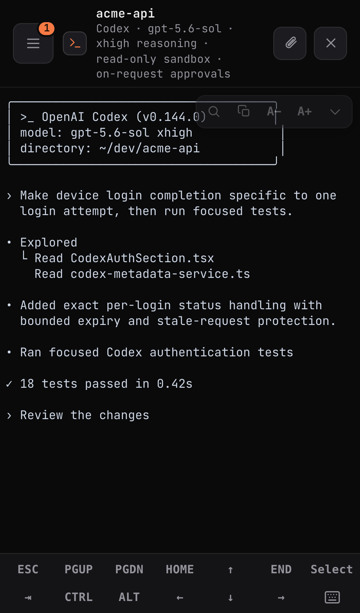

<div align="center">


# RoamCode

### The real Claude Code or Codex TUI — running on your machine, driven from any browser.

**[roamcode.ai →](https://roamcode.ai)**

A standalone, self-hosted control center for persistent coding-agent terminals. RoamCode runs the actual
`claude` or `codex` CLI on your machine and gives you its real terminal UI on desktop and mobile.

[](https://github.com/burakgon/roamcode/stargazers)
&nbsp;[](LICENSE)
&nbsp;[](https://github.com/burakgon/roamcode/discussions)
&nbsp;
&nbsp;

<br/>


&nbsp;

&nbsp;


<br/><br/>

**your browser** &nbsp;→&nbsp; **your RoamCode Node** &nbsp;→&nbsp; **`claude` or `codex`**

<sub>Standalone · self-hosted · direct device pairing · your existing CLI login · MIT</sub>

<br/><br/>

```bash
npx --yes --allow-scripts=better-sqlite3,node-pty roamcode@latest install
# macOS alternative:
brew install burakgon/roamcode/roamcode && roamcode install
```

Then create a five-minute, one-use pairing link:

```bash
roamcode pair
```

</div>

---

## Standalone by design

RoamCode has no hosted account, managed fleet, shared relay, or external control-plane dependency. Each installation
is an independent Node that owns its sessions, configuration, credentials, team policy, and data. Remote access uses
a network path you control: loopback, a private network, VPN, or a reviewed HTTPS reverse proxy.

Your provider login, repositories, prompts, terminal output, and execution stay on the Node. The public website is
documentation and installation guidance; it is not an account or terminal service.

## What it does

RoamCode starts the real coding-agent CLI inside `tmux` and connects an xterm.js terminal to it. It does not rebuild
the provider as a chat interface, so permission prompts, multiple-choice questions, slash commands, diffs, subagent
panels, model controls, and provider-native safety behavior remain intact.

- **Sessions** is the live workbench. Start, rename, split, inspect, resume, and close persistent terminals.
- **Automations** turns repeatable instructions into real, inspectable Sessions with manual, schedule, and webhook
  triggers supported by the local Node.
- **Agents** shows the Claude Code, Codex, and installed adapter runtimes available on this Node, including version,
  authentication, availability, and current Session count.

Existing v1 integrations and the additive product API are documented at `GET /api/v1/openapi.json`.

### The real terminal, not a transcript

<div align="center">

</div>

The full-screen TUI keeps its colors, box drawing, interactive prompts, tool output, and provider-specific controls.
Claude remains Claude-native; Codex keeps its own model, reasoning, sandbox, approval, profile, search, directory, and
dangerous-bypass settings.

### Persistent sessions and split panes

Every Session lives in `tmux`, so closing the browser or changing networks does not stop the agent. Desktop supports
resizable, draggable, persistent split panes; closing a pane detaches the view without terminating the Session.

<div align="center">

</div>

### Mobile terminal ergonomics

RoamCode adds a Termux-style key bar, sticky Ctrl, two-finger scrollback, long-press selection, and direct clipboard
actions without changing terminal semantics. The same app is responsive and installable as a PWA.

<div align="center">


</div>

### Attention, files, and updates

The Sessions rail distinguishes working, idle, and needs-input states. Upload files to a Session, browse and download
Node files, and receive agent-produced files in the Files panel. Web Push can bring you back when a Session needs a
decision. Stable updates are integrity-pinned to npm artifacts, boot-smoked before activation, and retain the last
verified release for rollback.

## Quickstart

Install the current stable release as a per-user LaunchAgent on macOS or `systemd --user` service on Linux:

```bash
npx --yes --allow-scripts=better-sqlite3,node-pty roamcode@latest install
```

The curl bootstrap invokes the same published installer:

```bash
curl -fsSL https://roamcode.ai/install | bash
```

Homebrew is also supported on macOS:

```bash
brew install burakgon/roamcode/roamcode
roamcode install
```

Use `roamcode status` to inspect the installed service, `roamcode pair` to authorize a browser, and
`roamcode uninstall` to remove the service. Operational data stays in `~/.config/roamcode` unless
`ROAMCODE_DATA_DIR` is set.

> Windows runs through WSL2; see [docs/windows-wsl.md](docs/windows-wsl.md).

### Source install

Requirements:

- Node.js 24 or newer
- pnpm 11.9.0 through Corepack
- tmux
- Claude Code, Codex, or another supported adapter installed and authenticated on the Node
- a native `better-sqlite3` build for durable storage

```bash
git clone https://github.com/burakgon/roamcode
cd roamcode
corepack enable
pnpm install
pnpm build
node packages/cli/dist/index.js
```

Use an isolated `ROAMCODE_DATA_DIR` and `PORT=0` for development or tests. Do not point a development process at an
installed service's data directory or port.

## Remote access

The default server binds to `127.0.0.1:4280`. Keep it on loopback unless you have deliberately secured the network
boundary. For another device, provide a stable route using a private network, VPN, SSH forwarding, or an HTTPS reverse
proxy you operate. HTTPS is required for an installed PWA and Web Push.

Create a one-use pairing link for that stable origin:

```bash
roamcode pair --url https://your-roamcode.example
```

The link expires after five minutes and can be claimed once. The browser receives an independently revocable device
credential; the host recovery credential never enters the URL or browser storage. Pair and revoke browsers from
**Settings → Devices**. Set `ROAMCODE_PUBLIC_URL` to the same stable origin for strict origin checks and notification
links.

## Teams and peer Nodes

A standalone Node can enforce local team roles, device-to-member assignments, resource grants, and organization
policy without an external identity service. The recovery credential remains break-glass administration.

Peer federation connects independent RoamCode Nodes directly over stable HTTPS. It uses explicit pairing, pinned Node
identity, least-privilege action/workspace scopes, and authorization on both sides. It does not centralize provider
credentials or source code. See [docs/peer-federation.md](docs/peer-federation.md).

## Configuration and diagnostics

See [docs/configuration.md](docs/configuration.md) for environment variables and CLI automation. Useful checks:

```bash
roamcode status
curl -fsS http://127.0.0.1:4280/health
```

Authenticated diagnostics are available through `/diag`, `/providers`, and the Settings UI. See
[docs/troubleshooting.md](docs/troubleshooting.md) before changing a live installation.

## Security

RoamCode is intentionally remote code execution on your own machine. Treat every paired device like an SSH key.

- The server requires a credential and defaults to loopback.
- Pairing links are high-entropy, expire after five minutes, and work once.
- Device credentials are separate and independently revocable.
- State-changing browser requests are protected by credential, origin, rate-limit, and CSWSH checks.
- `FS_ROOT` confines RoamCode file APIs, but does not sandbox Claude Code or Codex.
- Provider credentials and terminal data remain on the Node.

Never expose the plain HTTP port to the public internet. Review [SECURITY.md](SECURITY.md) for the complete threat
boundary and private vulnerability-reporting process.

## Contributing

Issues and pull requests are welcome. Read [CONTRIBUTING.md](CONTRIBUTING.md), run the full checks, and keep public
artifacts free of credentials, local paths, private hostnames, and production data.

MIT — see [LICENSE](LICENSE).
