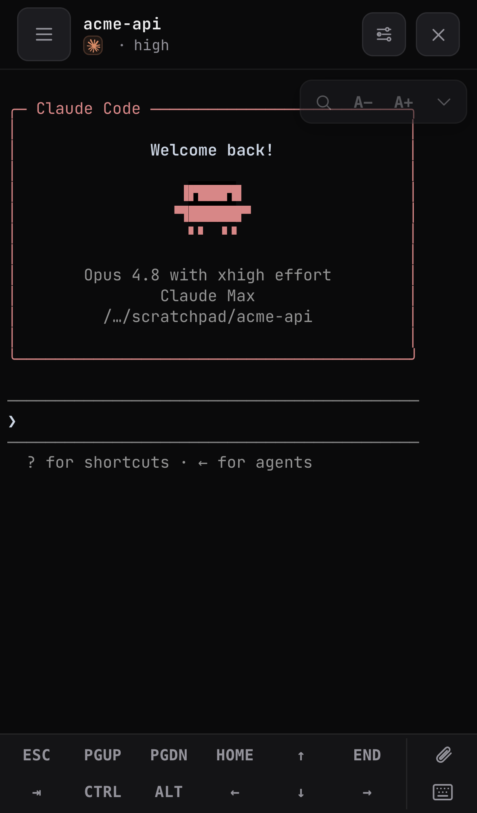
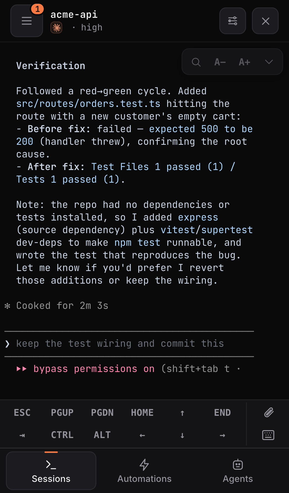
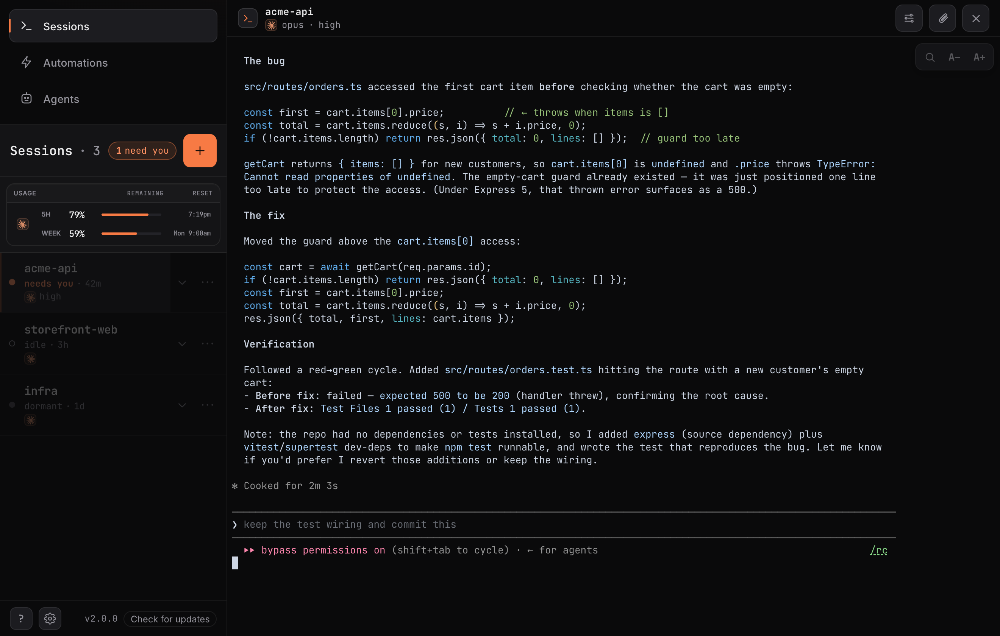
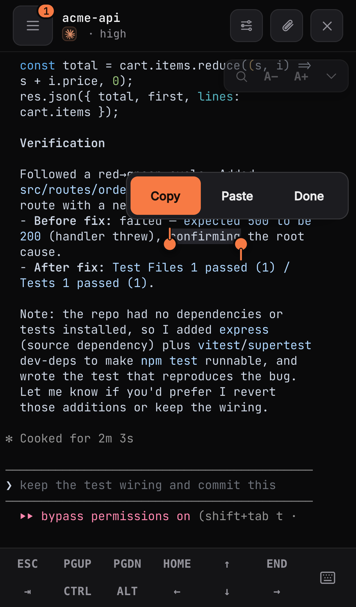
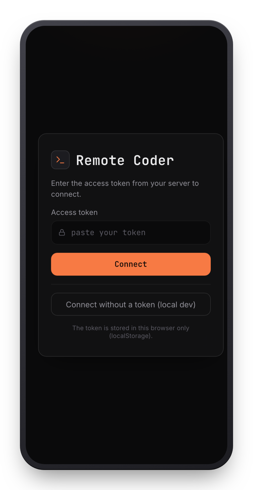
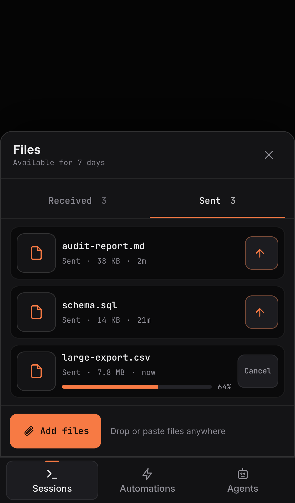

<div align="center">


# Remote Coder

### The real Claude Code — running on your machine, driven from your phone.

A self-hosted app that runs the **actual `claude` CLI** on your Claude subscription and puts its **real terminal UI** in your pocket. Not a chat that reimplements Claude Code — a live terminal bridged straight to the `claude` TUI running on your machine. What you'd see at your desk, you now see on your phone: the same prompts, the same questions, the same subagents, the same everything.

[](https://github.com/burakgon/remote-coder/stargazers)
&nbsp;[](LICENSE)
&nbsp;[](https://github.com/burakgon/remote-coder/discussions)
&nbsp;
&nbsp;
&nbsp;

<br/>


&nbsp;

&nbsp;


<br/><br/>

**📱 your phone** &nbsp;→&nbsp; 🔒 **your machine** *(Remote Coder)* &nbsp;→&nbsp; 🤖 **`claude` CLI** *(your subscription)*

<sub>Self-hosted · no API key · your code never leaves your machine · secured by a token · MIT</sub>

<br/><br/>

**Try it in ~60 seconds** — on the machine that has `claude` installed + logged in:

```bash
curl -fsSL https://raw.githubusercontent.com/burakgon/remote-coder/main/scripts/install.sh | bash
```

<sub>Clones, builds, and starts the server — then prints a one-time connect link to open on your phone. Prefer to read it first? See <a href="#quickstart">Quickstart</a>.</sub>

</div>

---

## What it is

You run a small server on your dev machine. It launches the **real Claude Code CLI** as a subprocess — on your own subscription, no API key — inside a persistent terminal, and serves a polished, installable app you open from your phone or any browser. The app is a **true terminal** (xterm.js) wired straight to that `claude` session, so you're not looking at a reinterpretation of Claude Code — you're looking at **Claude Code itself**, live, from anywhere.

That framing is the whole point:

- **Nothing is reimplemented, so nothing is lost.** Permission prompts, multiple-choice questions, subagent panels, slash commands, thinking, diffs — they all just work, because it's the genuine TUI, not a bespoke chat trying to keep up with it.
- **It survives real life.** The session lives in `tmux` on your machine. Lock your phone, lose signal, close the app, switch networks — reconnect and it re-attaches exactly where it was, command still running.
- **It's actually usable by thumb.** A full-screen terminal on a touchscreen is normally miserable; the hard part Remote Coder solves is the ergonomics — a Termux-style key bar, sticky Ctrl, two-finger scroll to read back, and tap-to-select copy.

It's **host-native** (your machine, your files, your `~/.claude`), **secure by default** (a mandatory access token), and **MIT** licensed.

## Why it exists

Anthropic ships first-party remote control and chat bots — but `claude` remote-control can only **resume** a session that was already started *at the machine*, and the third-party chat bots **reinterpret** Claude Code into a messaging UI, so they drift, drop features, and can't answer its prompts. The moment Claude needs a decision, you're stuck until you're back at your desk.

Remote Coder closes that gap by refusing to reinterpret anything — it just gives you the real terminal:

|  | `claude remote-control` | Telegram / Discord bots | **Remote Coder** |
|---|:---:|:---:|:---:|
| Start a **brand-new** session remotely | resume only | ✗ | **✓** |
| The **real** Claude Code TUI, nothing reinterpreted | resume only | ✗ | **✓** |
| Approve/deny tool use · answer questions, as at your desk | — | ✗ | **✓** |
| Survives a dropped connection / closed app *(tmux)* | ✗ | ✗ | **✓** |
| Files **to and from** the agent | ✗ | Telegram only | **✓** |
| Run **several** sessions at once | — | ✗ | **✓** |
| Installable app · self-hosted · MIT | — | — | **✓** |

## What you can do

### The real Claude Code, live in your pocket
The app renders the actual `claude` fullscreen TUI in a real terminal — colors, box-drawing, the logo, the lot. When Claude asks to run a tool, you get **its own permission prompt**; when it asks a multiple-choice question, you get **its own picker**; when it dispatches **subagents**, you watch them exactly as you would under the textbox at your desk. There's no feature to fall behind on, because it *is* Claude Code.

<div align="center">

</div>

### Made for thumbs, not just mirrored
A TUI on a phone is only good if you can actually drive it. Remote Coder adds a **Termux-style key bar** (Esc, Tab, arrows, Home/End, PgUp/PgDn, `/ - | ~`, `^C`, `^D`, Paste) with a **sticky Ctrl** that turns your next keystroke into a control chord. **Two fingers scroll** back through the transcript, a pinned **Select** button opens a plain, selectable copy of the screen for the OS copy menu, and `--dangerously-skip-permissions` is a clearly-marked, **per-session** toggle when you want it.

<div align="center">



</div>

### Never lose your place
Every session is a `tmux` session on your machine, and the terminal WebSocket **re-attaches** on reconnect. A locked phone, a subway tunnel, a killed app, a Wi-Fi→cellular hop — none of it interrupts the work. Come back and Claude is still there, still running, right where you left it.

### Files, both ways
Upload images and files into a session, browse and download host files, and just ask Claude to **send you a file or image** — it lands in the session's **Files** panel to view full-size or download. Screenshots in, a generated chart out, all from the phone.

<div align="center">


</div>

### Many sessions, and you know which one needs you
A live **sessions rail** (a bottom sheet on mobile, a permanent pane on desktop) lists every running `claude`, flags the ones **waiting on you**, and shows your **subscription usage** (the 5-hour and weekly limits) so you know how much runway is left. Start a new one anywhere via a **git-aware directory picker**.

### Built to live on your phone
An installable **PWA** (Add to Home Screen, no app store) and **Web Push** when a session finishes or needs a decision — so you can walk away and get pulled back only when it matters.

### Updates itself — one tap, no terminal
When a new version lands on GitHub, the app shows an **update notice** with the version and a grouped changelog. Tap **Update now** and the server pulls, rebuilds, and restarts itself, then reconnects on the new version — no SSH, no `git pull`. A failed build leaves the running server untouched.

## Quickstart

**Fastest path** — one command (clones into `~/remote-coder`, builds, starts, prints the connect link):

```bash
curl -fsSL https://raw.githubusercontent.com/burakgon/remote-coder/main/scripts/install.sh | bash
```

It preflights Node/pnpm/`claude`/`tmux` and tells you exactly what's missing. Prefer to do it by hand? Read on.

### Manual install

You need:

- **Node ≥ 24.** Check with `node --version`.
- **[pnpm](https://pnpm.io/).** The easiest way is `corepack enable` (ships with Node) — then `pnpm` just works in the repo. Otherwise `npm i -g pnpm`.
- **[tmux](https://github.com/tmux/tmux).** Each session runs inside tmux so it survives disconnects. `brew install tmux` (macOS) / `apt install tmux` (Debian/Ubuntu). Run it with a UTF-8 locale so Claude's box-drawing glyphs render.
- **Claude Code installed and logged in *on this machine*.** Run `claude` once in a terminal here and complete the login — there is **no remote login**, and a missing/unauthenticated `claude` is the #1 first-run failure (the app tells you which it is, and `/diag` shows `claude.available`).
- A working **native build of `better-sqlite3`.** `pnpm install` builds it; if your toolchain can't, the server still boots but **falls back to a non-durable in-memory store** (sessions vanish on every restart). It logs a loud warning and `/diag` reports `storeMode: "memory-fallback"` — see [Troubleshooting](docs/troubleshooting.md).

```bash
git clone https://github.com/burakgon/remote-coder && cd remote-coder
corepack enable                 # makes `pnpm` available (or: npm i -g pnpm)
pnpm install && pnpm build
node packages/cli/dist/index.js
```

It generates an access token and prints a ready-to-use link:

```
Remote Coder is running.
  Access token generated and stored in the data dir. Open this link to connect:
    http://127.0.0.1:4280/?token=<token>
```

Open it on the same machine — then read **[From your phone](#from-your-phone)** to reach it remotely.

> `npx remote-coder` isn't published yet — the CLI is `private` while the monorepo stabilizes. Clone + build is the supported path today.

## From your phone

The server binds to `127.0.0.1` and **should not be exposed directly**. Put an HTTPS tunnel in front of it (the installable app and Web Push both require HTTPS) — your machine stays the host, and the token is still enforced on every request through the tunnel.

```bash
# with the server running on 127.0.0.1:4280
cloudflared tunnel --url http://127.0.0.1:4280
```

Open the printed `https://…` link on your phone, paste the token (or use the `?token=…` link), **Add to Home Screen**, and turn on notifications. *(Tailscale Serve works too: `tailscale serve --bg http://127.0.0.1:4280`.)*

> ⚠️ **`cloudflared tunnel --url` gives you an *ephemeral* `trycloudflare.com` URL that changes every run.** That's fine for a quick try, but an **installed PWA is bound to the origin you installed it from** — when the URL changes, your home-screen app points at a dead origin and push deep-links break. For real day-to-day use, set up a **named/stable tunnel** (a fixed hostname) — Cloudflare Named Tunnel, or Tailscale Serve, whose `…ts.net` hostname is stable — and set `REMOTE_CODER_PUBLIC_URL` to that origin so push notifications click through to the right place.

<details>
<summary><b>Run it as a background service · flags · environment variables</b></summary>

<br/>

`node packages/cli/dist/index.js install` writes a per-user service unit (**macOS** LaunchAgent / **Linux** `systemd --user`) and prints the one command to enable it — nothing auto-starts until you opt in. It runs as **you**, not root. On macOS it runs while you're logged in (Claude's subscription auth needs a real login session).

| Var | Default | Purpose |
|---|---|---|
| `PORT` | `4280` | Listen port (`0` = OS-chosen). |
| `BIND_ADDRESS` | `127.0.0.1` | Keep loopback; use a tunnel for remote. |
| `ACCESS_TOKEN` | _(generated)_ | Override the token (used verbatim, never written to disk). |
| `NO_TOKEN` | _(unset)_ | `1` = tokenless dev mode. **Loopback binds only** — it refuses to start non-loopback. |
| `FS_ROOT` | `$HOME` (then cwd) | Confine the file picker / fs endpoints to a subtree. **Does not sandbox the agent** (see Security). |
| `MAX_UPLOAD_BYTES` | `26214400` | Upload size cap (25 MiB). |
| `REMOTE_CODER_DATA_DIR` | `~/.config/remote-coder`¹ | SQLite DB, token, VAPID keys, **logs** (mode 0700). |
| `REMOTE_CODER_PUBLIC_URL` | _(bind URL)_ | Your user-facing origin (the tunnel URL). **Set this** behind a tunnel: it's the click-target for push notifications and an allowed Origin. |
| `TRUST_PROXY` | `false` | `1`/`true` = honor `X-Forwarded-For` behind a reverse proxy, so the per-client lockout/rate-limit key on the real client IP (not the proxy's). |
| `REMOTE_CODER_ALLOWED_ORIGINS` | _(empty)_ | Comma-separated extra Origins the CSWSH guard allows (beyond same-origin/loopback/`PUBLIC_URL`). |
| `REMOTE_CODER_RATE_LIMIT_RPM` | `600` | Sustained requests/minute per client. `0` **disables** the limiter. |
| `REMOTE_CODER_RATE_LIMIT_BURST` | `120` | Instantaneous burst allowance (token-bucket). |
| `REMOTE_CODER_MAX_SESSIONS` | `25` | Max concurrent **live** `claude` sessions; new spawns get `429` at the cap. `0` = unbounded. |
| `CLAUDE_BIN` | `claude` | Path/name of the Claude Code CLI to spawn (must be on the service's PATH). |
| `VAPID_SUBJECT` | `mailto:remote-coder@localhost` | `mailto:`/URL contact in the Web Push VAPID claim. |
| `WEB_DIR` | _(bundled)_ | Override the path to the built PWA (`packages/web/dist`). |
| `XDG_CONFIG_HOME` | _(unset)_ | When `REMOTE_CODER_DATA_DIR` is unset, the data dir is `$XDG_CONFIG_HOME/remote-coder`. |
| `REMOTE_CODER_SERVICE_MANAGER` / `_LABEL` | _(auto)_ | Override which service the OTA self-updater restarts (`launchd`/`systemd` + label). Normally read from `service.json`. |

¹ `REMOTE_CODER_DATA_DIR` → else `$XDG_CONFIG_HOME/remote-coder` → else `~/.config/remote-coder` → else `./.remote-coder`.

The **access token never enters argv** (it lives in a `0600` file). `ANTHROPIC_API_KEY` is always stripped from the spawned `claude` (subscription auth only). The token-rotation grace window (old token honored briefly after `POST /token/rotate`) is a fixed **60s** and is not env-tunable. `--port <n>`, `--bind <addr>`, `--no-token` (loopback dev only) are also available; `--help` for the full list.

### Logs & diagnostics

- **macOS (LaunchAgent):** stdout → `<data-dir>/remote-coder.log`, stderr → `<data-dir>/remote-coder.err.log` (`<data-dir>` defaults to `~/.config/remote-coder`). These are **not rotated** — cap them with the OS log rotator (a `newsyslog.d` entry) or periodically truncate. `tail -f ~/.config/remote-coder/remote-coder.err.log`.
- **Linux (`systemd --user`):** logs go to **journald** — `journalctl --user -u remote-coder -f` (journald already size-bounds itself; tune with `journalctl --user --vacuum-size=50M`).
- **`GET /diag`** (token-gated, like every API route) returns a JSON health snapshot: running build sha + whether it drifted from the checkout, store mode (`sqlite` vs the non-durable `memory-fallback`), `claude` availability + version, Node version, and the last update state. Open `https://<host>/diag` with the token header, or `curl -H "Authorization: Bearer <token>" http://127.0.0.1:4280/diag`. `GET /health` is the only unauthenticated route (returns `{ ok: true }` only).

</details>

## Security

Remote Coder is, by design, **remote code execution on your own machine** — that's the whole point. Treat the token like an SSH key.

- **Single mandatory token** on every request and WebSocket — constant-time check, per-client lockout. It is a **single shared secret** (not per-user/per-device): anyone with it has full access. It **refuses to start** on a non-loopback bind without one. Rotate it anytime with `POST /token/rotate` (the old token is honored for a 60s grace, then rejected; the app re-stores the new one).
- **HTTPS for anything remote** — a plain public port leaks the token. Always tunnel.
- **The permission gate stays on** — you approve every tool from the terminal, exactly as you would at your desk. `--dangerously-skip-permissions` is per-session, **off by default**, and clearly marked.
- **⚠️ The agent is NOT sandboxed.** The `claude` subprocess runs as **you**, with your full machine access — it can run any command and touch any file your user can. `FS_ROOT` only scopes Remote Coder's *own* file-browser/upload/download endpoints; it does **not** confine what `claude` itself can read or write. Run this only on a machine you'd hand someone with your shell.
- **Defense-in-depth controls** (all on by default, tunable — see the env table): a **cross-origin (CSWSH) guard** rejects a present, cross-origin, non-allow-listed `Origin` (`REMOTE_CODER_ALLOWED_ORIGINS`, `REMOTE_CODER_PUBLIC_URL`); a per-client **rate limiter** (`REMOTE_CODER_RATE_LIMIT_RPM`/`_BURST`, `0` disables); a **concurrency cap** on live sessions (`REMOTE_CODER_MAX_SESSIONS`); and `TRUST_PROXY` so those keys on the real client IP behind a proxy.

**Stuck or unsure?** See **[docs/troubleshooting.md](docs/troubleshooting.md)** for the common first-run and runtime failures.

## Community & Contributing

- 💬 **Questions, ideas, "show your setup"** → [GitHub Discussions](https://github.com/burakgon/remote-coder/discussions)
- 🐛 **Bugs / feature requests** → [Issues](https://github.com/burakgon/remote-coder/issues/new/choose)
- 🔒 **Security** → [SECURITY.md](SECURITY.md)
- 🤝 **Contributing** → [CONTRIBUTING.md](CONTRIBUTING.md)

If it's useful to you, a ⭐ genuinely helps other Claude Code users find it.

Full-TypeScript pnpm monorepo — `server` · `web` · `cli`. The server bridges a terminal WebSocket to the `claude` TUI running under `tmux` (via `node-pty`); the web app is an installable React PWA built on `xterm.js`.

```bash
pnpm install && pnpm build
pnpm typecheck && pnpm lint && pnpm test
```

Released under the **[MIT](LICENSE)** license.
