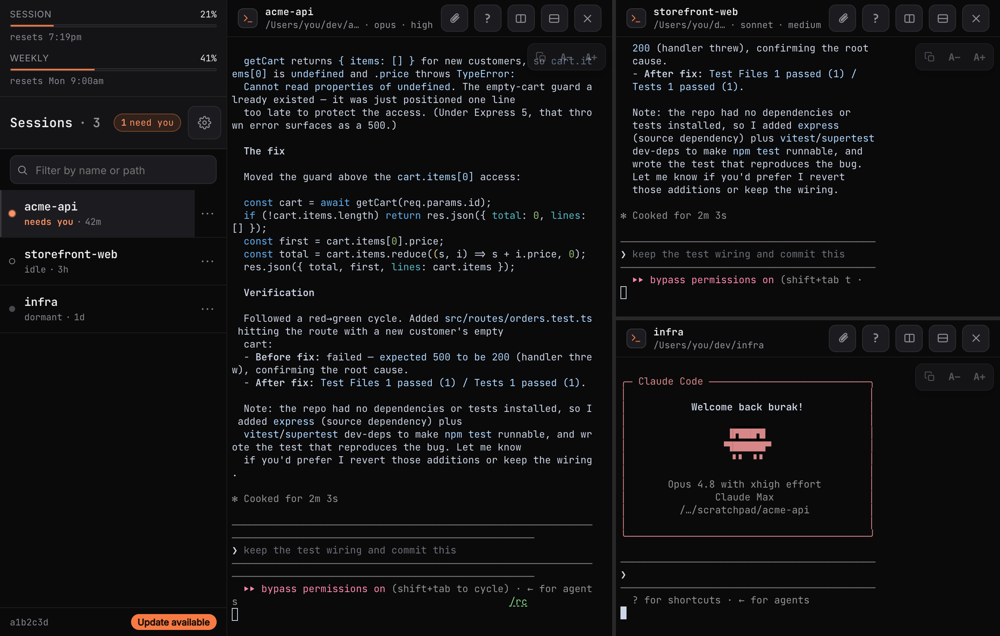
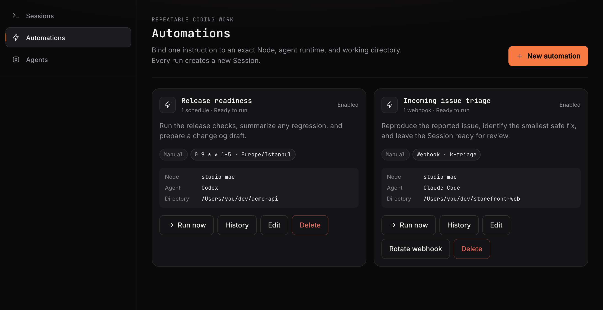
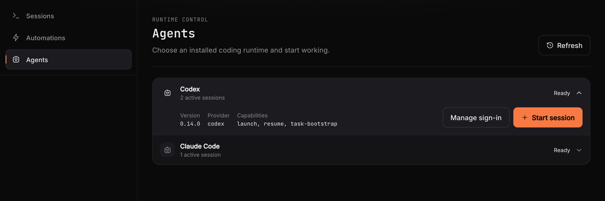

<div align="center">


# RoamCode

### Self-hosted mission control for Claude Code and Codex.

Run the real coding-agent TUI on your own machine. Keep Sessions alive, step in from any browser,
and turn repeatable work into Automations — without replacing the CLI you already trust.

**[Website](https://roamcode.ai)** · **[Get started](docs/getting-started.md)** · **[Documentation](docs/README.md)** ·
**[Discussions](https://github.com/burakgon/roamcode/discussions)**

[](https://github.com/burakgon/roamcode/actions/workflows/ci.yml)
[](https://www.npmjs.com/package/roamcode)
[](https://github.com/burakgon/roamcode/releases/latest)
[](LICENSE)


</div>

<div align="center">
  
</div>

## Start in three steps

RoamCode installs as a per-user service. It defaults to `127.0.0.1`, keeps its own data locally, and prints a
five-minute, one-use pairing link when installation finishes.

### 1. Install on the machine that runs your agents

macOS with Homebrew (recommended; installs Node.js and tmux dependencies):

```bash
brew install burakgon/roamcode/roamcode && roamcode install
```

macOS or Linux with Node.js 24+ and tmux already installed:

```bash
curl -fsSL https://roamcode.ai/install | bash
```

Prefer to inspect the bootstrap first? Read [`scripts/install.sh`](scripts/install.sh), then run the published CLI
directly:

```bash
npx --yes --allow-scripts=better-sqlite3,node-pty roamcode@latest install
```

### 2. Open the pairing link

The installer verifies that the service is healthy, then prints a QR code and one-use link. Open it in a browser on
the same machine. For a phone or another computer, first create a private or HTTPS route you control, then run:

```bash
roamcode pair --url https://your-roamcode.example
```

### 3. Start a Session

Choose **Claude Code** or **Codex**, pick a working directory, and start. The provider's real TUI runs inside `tmux`,
so closing the tab or changing networks does not stop the work.

> You need at least one supported provider CLI installed and authenticated on the Node. See the complete
> [getting-started guide](docs/getting-started.md), including Linux prerequisites, remote access, and recovery.

## One control loop

RoamCode is not a chat wrapper and it is not a hosted IDE. It is the control layer around the agent processes already
running on your machine.

| Surface | What it owns |
| --- | --- |
| **Sessions** | Live Claude Code and Codex terminals, status, files, split panes, resume, and intervention. |
| **Automations** | Repeatable instructions with manual, schedule, and webhook triggers. Every Run becomes an inspectable Session. |
| **Agents** | Installed runtimes, authentication, availability, versions, capabilities, and active work on this Node. |

<div align="center">
  
</div>

<div align="center">
  
  
</div>

## The terminal stays the terminal

RoamCode streams the actual full-screen provider TUI through xterm.js. Permission prompts, slash commands, diffs,
model controls, subagent panels, sandbox settings, approval policies, and provider-native safety behavior remain
intact.

- Sessions persist in `tmux` and reconnect after browser or network changes.
- Desktop supports resizable, draggable, persistent split panes.
- Mobile adds a Termux-style key bar, sticky Ctrl, two-finger scrollback, selection, clipboard, and file exchange.
- “Needs input” status and Web Push take you directly back to the Session that is waiting.
- Stable updates are integrity-pinned, boot-smoked before activation, and retain the previous verified release for
  rollback.

<table>
  <tr>
    <td width="50%"><strong>Step into the live TUI</strong><br><sub>Respond to the exact prompt or permission in place.</sub><br><br></td>
    <td width="50%"><strong>Select, copy, and chord</strong><br><sub>Use selection, clipboard controls, sticky Ctrl, arrows, Esc, and paging.</sub><br><br></td>
  </tr>
  <tr>
    <td width="50%"><strong>Move the artifacts</strong><br><sub>Upload inputs and download files produced by the Session.</sub><br><br></td>
    <td width="50%"><strong>Start the next Session</strong><br><sub>Choose a Git-aware working directory without returning to a desk.</sub><br><br></td>
  </tr>
</table>

## Local-first by construction

```text
browser / installed PWA
          │
          │  device credential + network path you choose
          ▼
your RoamCode Node
          ├── persistent tmux Sessions
          ├── local Automations
          └── your installed claude / codex CLI
```

There is no RoamCode account, managed relay, or hosted control plane. Your repositories, provider credentials,
prompts, terminal output, and execution stay on the Node. Provider CLIs continue to use their normal provider
services. Remote access can use a private network, VPN, SSH forwarding, or an HTTPS reverse proxy you operate.

RoamCode is intentionally remote code execution on your own machine. Treat every paired browser like an SSH key and
never expose the plain HTTP port to the public internet. Read the [security boundary](SECURITY.md) before enabling
remote access.

## Documentation

| Guide | Use it for |
| --- | --- |
| [Getting started](docs/getting-started.md) | Install, pair, launch the first Session, and verify the service. |
| [Remote access](docs/remote-access.md) | Connect another device without exposing an unsafe public port. |
| [Configuration](docs/configuration.md) | Environment variables, service behavior, API automation, and data paths. |
| [Troubleshooting](docs/troubleshooting.md) | Diagnose service, provider, terminal, pairing, and update failures. |
| [Windows through WSL2](docs/windows-wsl.md) | Run the Linux service and reach it safely from Windows. |
| [Peer federation](docs/peer-federation.md) | Connect independent Nodes directly with explicit scopes. |
| [Release model](docs/releases.md) | Stable SemVer, npm, Homebrew, and OTA guarantees. |

The additive product API is published by every Node at `GET /api/v1/openapi.json`.

## Development

```bash
git clone https://github.com/burakgon/roamcode.git
cd roamcode
corepack enable
pnpm install
pnpm build
```

Use an isolated `ROAMCODE_DATA_DIR`, tmux socket, and `PORT=0` for development or tests. Do not point a development
process at an installed service's data directory or port. See [CONTRIBUTING.md](CONTRIBUTING.md) for the complete
workflow and quality bar.

## Community

- Ask questions and show what you are building in [Discussions](https://github.com/burakgon/roamcode/discussions).
- Report reproducible bugs with the [issue templates](https://github.com/burakgon/roamcode/issues/new/choose).
- Propose focused improvements through pull requests after reading [CONTRIBUTING.md](CONTRIBUTING.md).
- Report vulnerabilities privately through GitHub; never open a public security issue. See [SECURITY.md](SECURITY.md).

RoamCode is MIT licensed. See [LICENSE](LICENSE).
